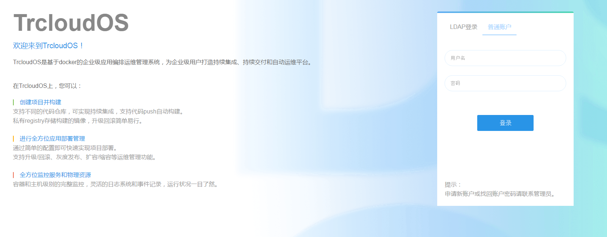
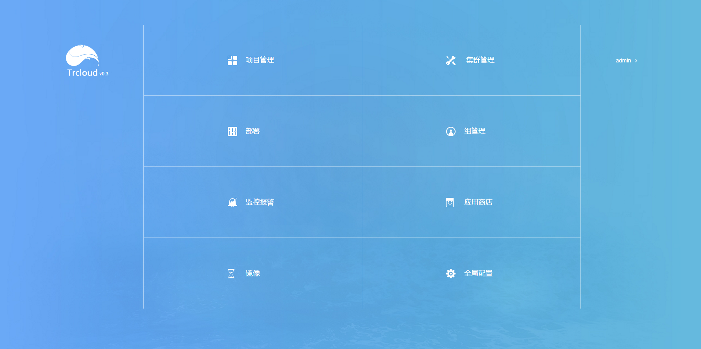

# 配置控制台组件

---
##配置并启动MySQL

TrcloudOS的相关数据均存储在Mysql中，可自行选择使用容器或非容器方式启动MySQL，Mysql成功启动后需创建TrcloudOS所需数据库和表结构。

###操作步骤

1. 下载http://172.30.251.187:12322/mysql-db/目录下的mysql-initialize.sh和所有sql文件至本地目录；

2. 设置如下环境变量(要创建数据库，用户需要有root权限)：

 MYSQL_HOST: MySQL服务地址
 
 MYSQL_PORT: MySQL服务端口
 
 MYSQL_USERNAME: 用于登录MySQL服务器的用户名
 
 MYSQL_PASSWORD: 用于登录MySQL服务器的密码

3. 执行脚本mysql-initialize.sh，将在MySQL中创建domeos、graph、portal三个数据库以及相关数据表，并向数据表中插入初始数据，建立管理员账户(初始用户名和密码均为admin)。

###注意事项

为保证TrcloudOS各组件正确连接数据库，需确保数据库给flannel中配置的IP段(容器的IP地址段)以及启动Kubernetes master时设置的--service-cluster-ip-range地址段授权，且与连接数据库相关的防火墙配置正确。

##配置并启动TrcloudOS Server

可自行选择使用容器或非容器方式启动TrcloudOS Server。

* 非容器方式

1. 下载TrcloudOS的war包，下载地址：http://172.30.251.187:12322/Trcloud-war/ROOT.war

2. 设置如下环境变量，将ROOT.war放置在tomcat的/usr/local/tomcat/webapps目录下，再启动tomcat服务:

 MYSQL_HOST: MySQL服务地址
 
 MYSQL_PORT: MySQL服务端口
 
 MYSQL_USERNAME: 用于登录MySQL服务器的用户名
 
 MYSQL_PASSWORD: 用于登录MySQL服务器的密码
 
 MYSQL_DB: TrcloudOS使用的数据库名，若使用mysql-initialize.sh进行MySQL的初始化，此数据库名应为"domeos"
3. 以非容器形式启动TrcloudOS Server时，需要单独启动WebSSH Server，具体启动方式见"配置WebSSH组件"章节。

启动成功后可通过浏览器访问TrcloudOS进行验证。

* 容器方式

###镜像

172.30.248.190:5000/trcloud_modify:0.3

###启动命令

sudo docker run -d --restart=always \

    --name <_trcloudos_server_name> \
    -p <_trcloudos_server_port>:8080 \
    -e MYSQL_HOST=<_mysql_host> \
    -e MYSQL_PORT=<_mysql_port> \
    -e MYSQL_USERNAME=<_mysql_username> \
    -e MYSQL_PASSWORD=<_mysql_password> \
    -e MYSQL_DB=<_mysql_db> \
    172.30.248.190:5000/trcloud_modify:0.3
###参数说明

_trcloudos_server_name: 容器的名字

_trcloudos_server_port: TrcloudOS Server的服务端口

_mysql_host: MySQL服务地址

_mysql_port: MySQL服务端口

_mysql_username: 用于登录MySQL服务器的用户名

_mysql_password: 用于登录MySQL服务器的密码

_mysql_db: TrcloudOS使用的数据库名，若使用mysql-initialize.sh进行MySQL的初始化，此数据库名应为"domeos"
###样例

sudo docker run -d --restart=always \

    --name trcloud_server \
    -p 8080:8080 \
    -e MYSQL_HOST=10.10.10.10 \
    -e MYSQL_PORT=3306 \
    -e MYSQL_USERNAME=root \
    -e MYSQL_PASSWORD=mypassword \
    -e MYSQL_DB=domeos \
   172.30.248.190:5000/trcloud_modify:0.3
###注意事项

镜像启动时设置了--restart-always，请根据实际需求进行配置。

##验证

在浏览器中访问TrcloudOS Server地址，将会进入TrcloudOS登录界面：

选择普通账户登录，输入初始用户名admin和初始密码admin，点击登录即可进入TrcloudOS主界面，可以看到TrcloudOS的各个模块：

至此TrcloudOS Server已成功配置并启动。